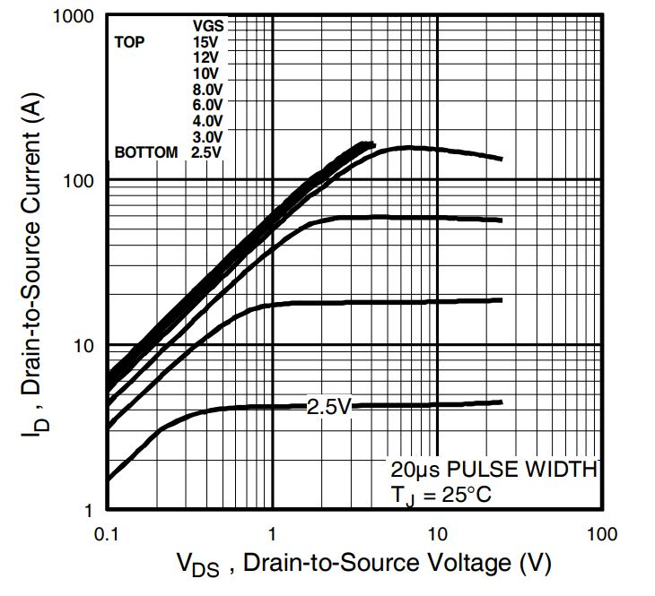

# Some notes about the circuit

The sections below are back-of-the-envelope style calculations on the power consumption of the circuit board and give some insight into the design process. I am not an expert by any means on this material, so don't take the approaches below as gospel.

## Resistive lamps

The lamps operate on 12V power.

Power draw (measured, specific to the type of lights used - best if you run your own measurements if you want to be sure):

| PWM value | current draw | power (V*I) |
| --------- | ------------ | ----------- |
| 30        | 0.14A        | 1.68        |
| 60        | 0.24A        | 2.9W        |
| 100       | 0.36A        | 4.3W        |
| 200       | 0.6A         | 7.2W        |
| 255       | 0.72         | 8.6W        |

So running 12 lights at max PWM would consume **103 W!** 

Practical values may be at most PWM 60 -> so a total power draw of **34W**, which is more reasonable, and generally not all lights will be on at the same time, so that is fine.

## MOSFETS

The MOSFETs are of type `IRLZ44N`.

Do these need heatsinks for our application?

Let's have a look at the datasheet, provided by Infineon.

We have a VGS of 3.3 V, so we can look at our maximum current values (0.72A, see above), the V_ds is well under 0.1V. Let's for simplicity call it **0.1V V_ds**.

> Measured V_ds values (when MOSFET gate is high) shows a measured voltage of ~0.05V

The power dissipation in the MOSFET will be **0.1 * 0.72A = 0.07W**. This is **far under 1W**, and hence we do not need any further cooling than the included tiny metal heatsink.

