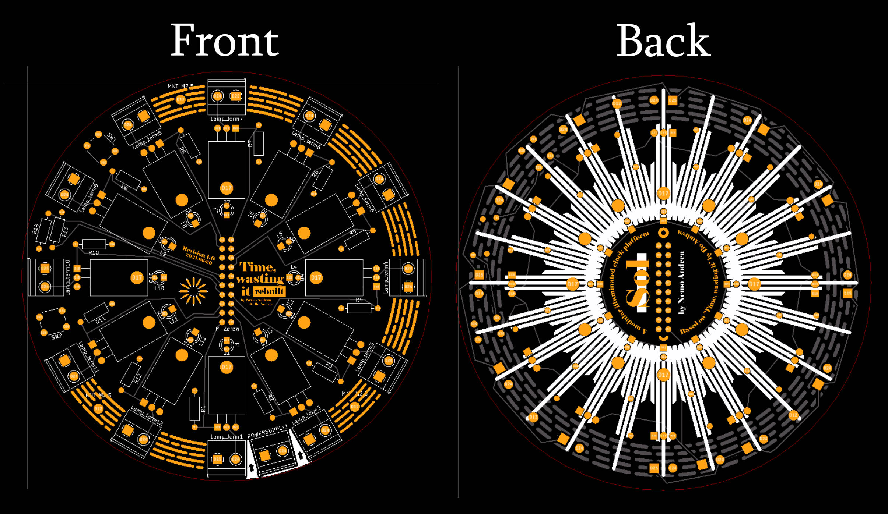
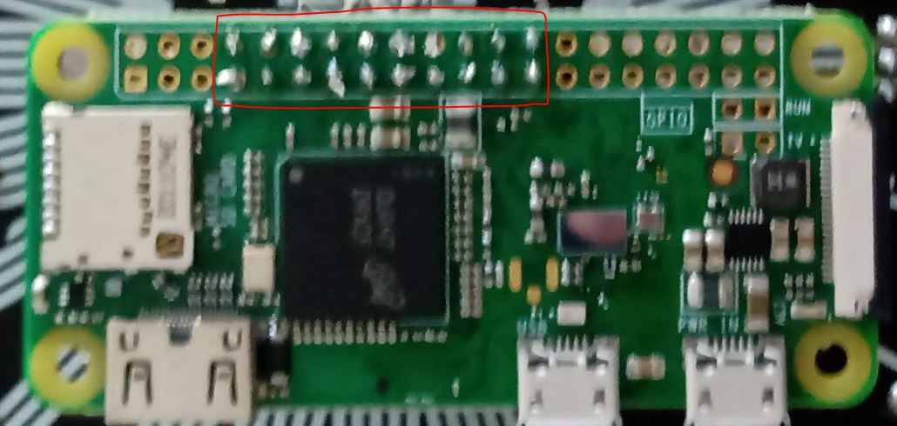

# Hardware setup for *Time, wasting it*

>  ⚠️ **Warning: the PCB design discussed below does not adhere to good design practices and should not be used as reference for how items should be routed or general PCB layout tricks**

### Component list

To build the *time, wasting it* clock, you will need the following components

1. The clock PCB; files can be found [in the PCB folder](../pcb)
2. Wires, solder and soldering station.
3. The following through-hole components
| Item                                              | Ref                      | amount | price per part in EUR(approximate) |
| ------------------------------------------------- | ------------------------ | ------ | ---------------------------------- |
| 3mm Yellow LED (or any led that turns on at 3.3V) | HuiYuan 3004Y1D-EHC-B    | 12     | 0.17                               |
| IRLZ44N MOSFET                                    | IRLZ44N                  | 12     | 1                                  |
| 500 Ohm resistor (52mm)                           | TC-MOR01SJ0501A10203     | 12     | 0.07                               |
| 2-pin terminal block 5.08 pitch                   | TE Connectivity 796949-2 | 13     | 1.15                               |
| 4.3mm button                                      | APEM PHAP3301            | 2      | 0.2                                |
| 2x10  header pins for rpi                         | BKL electronic 393505    | 1      | 0.4                                |
| 2x10 header pins (female) for pcb                 | econ connect MP70D       | 1      | 2.6                                |
3. A Raspberry Pi Zero W (any revision should work, but tested on Pi Zero W (1))
4. Lights of your choosing (12X). For the build as shown below the [Philips 5552130](https://www.philips.nl/c-p/12866B2/vision-conventionele-binnenverlichting-en-signalering) lamps were used. *About 1 euro per lamp*
5. A power supply. This can be a barrel plug type, or if you have low power consumption lights, you could get away with a USB power supply. For this project I used a `Mean Well GSM60A12-P1J` 12V 5A power supply with standard 5.5mm barrel plug.
   1. You will have to find a way to connect the power supply power and ground to the main terminal on the PCB. This will probably require some extra parts. For this build a barrel plug adapter was used a [generic 5.5mm barrel jack female to terminal adapter](https://www.tinytronics.nl/shop/en/cables-and-connectors/connectors/screw-terminals/dc-jack-female-5.5mm-to-terminal-block)
6. [optional] a PPTC resettable fuse (for the build I used a `ECE RB500-30`)
7. [optional - if your lights do not use a 5V voltage] a buck converter to convert **lamp voltage** to **5V for RPi**. For this build, a generic 12V to 5V buck converter was used.
8. [optional] some kind of 2.5mm mounting solution. The board has three 2.5mm holes that can be used to secure it.

 ### Walkthrough

The PCB is very simple, with the Raspberry Pi GPIO pins driving a MOFSET gate, which then is directly to power supply voltage and the lights. 

> Note that there is **no** in series resistor with the light source, which would be problematic if plain LEDs were used instead of the Philips lamps, which are their own resistor.

There are two extra buttons on the PCB, which are not essential to the clock's functioning, and so can be left out. They can be useful during the testing process. Lights are hooked into screw terminals. For LED light sources, be careful with the polarity.

### PCB

The [custom PCB for the project](../pcb) follows the schematic given above, and contains some decorations. Note that some of the copper traces are exposed for cosmetic purposes only. Gerber art was generated using [the gerbolyze package by jaseg](https://github.com/jaseg/gerbolyze) which makes putting SVG art onto an existing Gerber design easy.

### Assembly

1. Solder all the through hole components onto the board (MOSFETs, LEDs, terminals, resistors, buttons)

2. Solder the female header pins onto the **back side** of the PCB.

   > It should now look something like this:
   >
   > 

3. Hook up the lights (whichever type you have chosen) to the 12 terminals

4. Solder the 10x2 header onto the Raspberry Pi zero, making sure to put headers on the exact same places as the image below
   

5. Add the raspberry to the PCB via the headers. **Note the orientation relative to the PCB art**
   

6. Make a quick and dirty bypass between these two pins (or better yet, fix it before you order the PCB - source KICAD files are in the directory)
   

7. Now we can start to set up the power supply. 

   1. The main PCB gets powered through the 13th terminal. Note the positive (red) and ground (black) locations. This is the voltage that is put on the source of the MOSFETs.
      

   2. The Raspberry Pi will probably need a different voltage than your lights. A simple buck converter can be used for this application. You can either get a buck converter with a USB output, and then power the Raspberry Pi through that usb cable, or solder the +5V and ground directly to the pads on the Raspberry Pi PCB.

      > Note: when soldering directly, be sure to do some research on what are the correct pads. It is easy to get the wrong pad and bypass the fuse of the Pi.
      
   3. [optional] when using a barrel plug for power supply, you can use [this simple 3D-printable part](../3D-printing) that can be used to secure a `5.5mm barrel jack female to terminal adapter` using screws.
   
8. [optional] Add a PPTC fuse (or other kind) to the main power line. That should give some protection against excessive current draw.

### Hardware Issues

There are some issues with the hardware that would best be addressed if you are making your own copy.

1. The PCB trace width is too narrow for the amount of current going through it (for the philips bulbs listed above). The software for the clock offers options to turn down the brightness, but it would be good to make the +12V lines thicker
2. The bypass needed is due to a small error in the routing and interpreting the Raspberry Pi GPIO. A quick edit in KICAD should fix that
3. The power supply listed has a lot of coil whine when drawing large amounts of current. I am not sure what can be done to address that, spare maybe adding a capacitor somewhere. This is probably not a significant issue with lower power draw light sources (and matching power supply).

