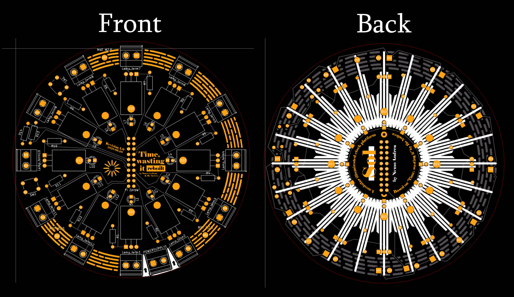
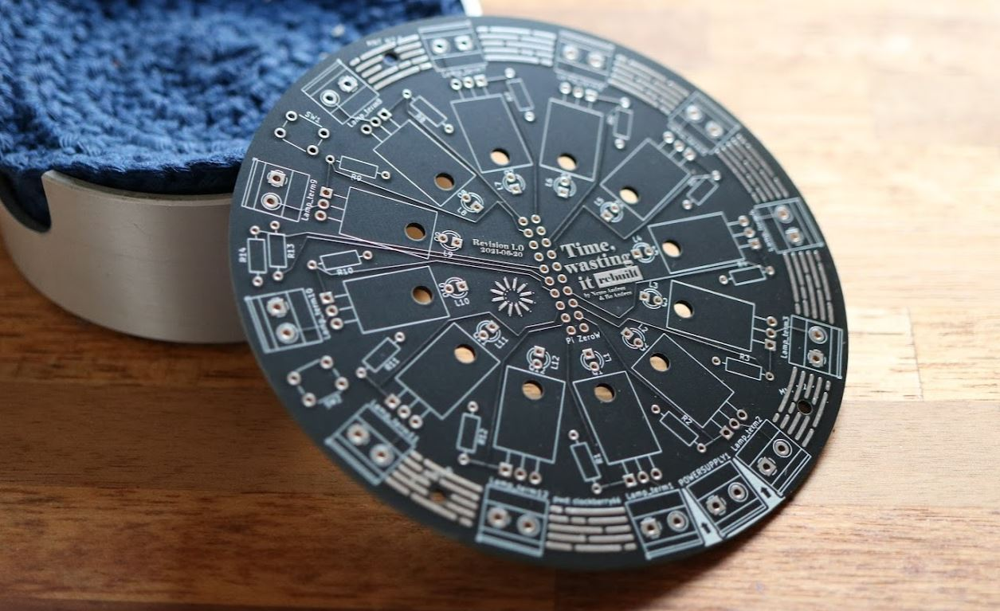
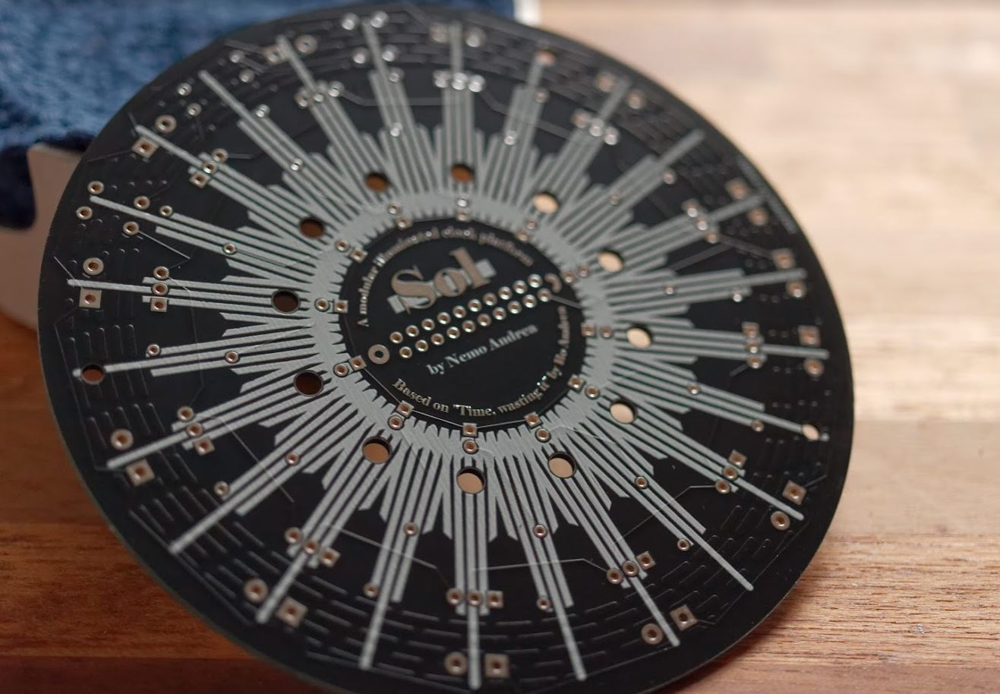

# Gerber Files

This directory contains Gerber and drill files which can be directly provided to a PCB manufacturer and with that, an order placed.

If you want to inspect the Gerber files, there are many viewers available. [Kicad](https://www.kicad.org/), which was used to make the designs, comes with a build in `GerbView` utility that can be used to view Gerber files, but you can also use the free [online viewer of Ucamco](https://gerber-viewer.ucamco.com/)

For assembly instructions and more comments on the hardware, consult the [hardware setup section](../../docs/hardware.md)

### Produced board

I had my copies of the board make by **JLCPCB**. I think they came out looking quite nice.

